<h1 align="center">ItsAsd</h1>

<p align="center">
  Minecraft Systems Developer • Gameplay Engineer • Creative Builder
</p>

<p align="center">
  
</p>

<br>

<p align="center">
  
  
  
  
  
  
</p>

---

<p align="center">
  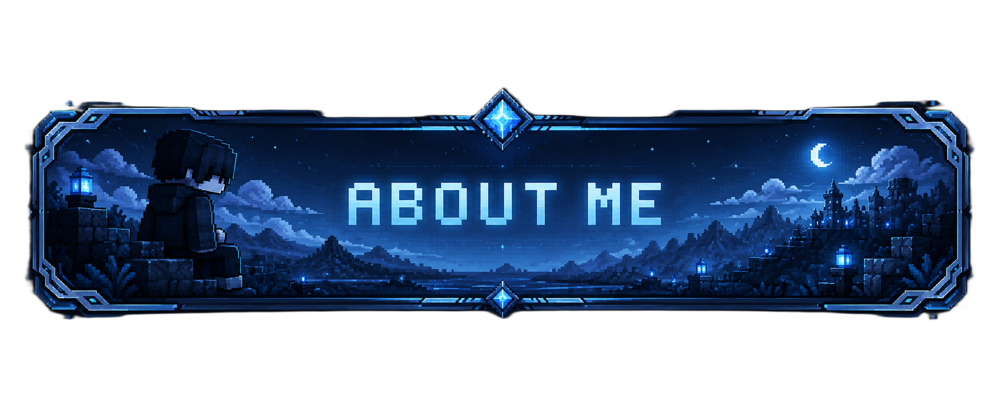
</p>

<p align="center">
  
</p>

I started experimenting with Minecraft servers back in 2016 using small Aternos worlds while barely running the game at 15 FPS.

What started as simple server configuration slowly became a passion for gameplay systems, multiplayer infrastructure and immersive experiences.

Today, I focus on creating systems that transform Minecraft into something deeper, more dynamic and more memorable.

- 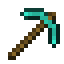 Passionate about mining systems
- 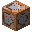 Backend & gameplay focused
- 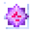 Self-taught developer
-  Always experimenting with new mechanics

---

<p align="center">
  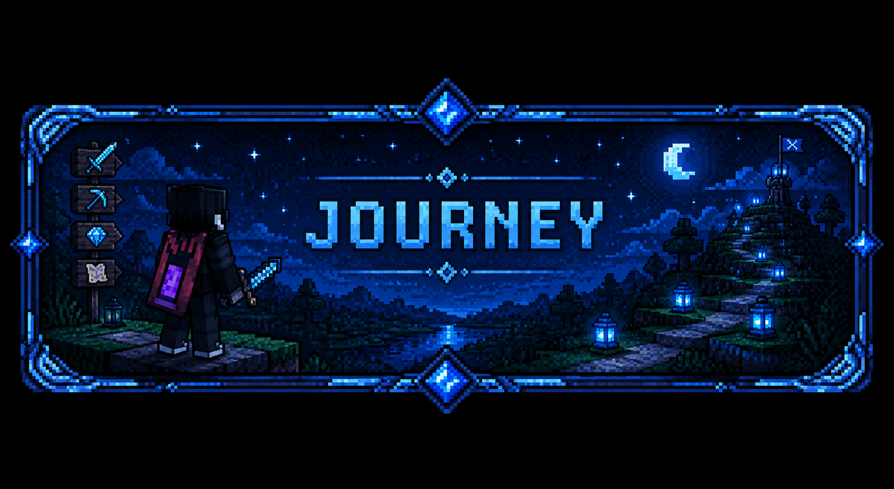
</p>

<p align="center">
  
</p>

```txt
2016 -> First Aternos server
2018 -> Learning plugins & server setup
2020 -> Public Minecraft networks
2022 -> Custom gameplay mechanics
2024 -> Large-scale core systems
2026 -> Gameplay & infrastructure focused development
```

Most of my experience comes from:

-  Documentation
- 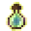 Trial & error
- 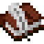 Communities
- 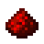 Real project experimentation

---

<p align="center">
  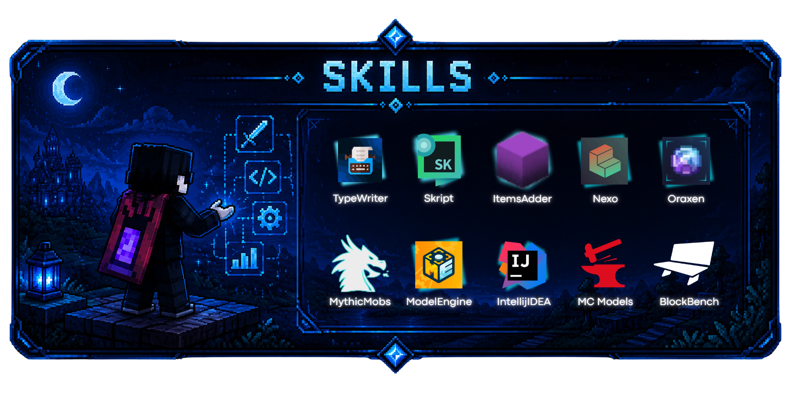
</p>

<p align="center">
  
</p>

<table>
<tr>

<td valign="top">

### Systems

- Progression Systems
- Economy Mechanics
- Mining Systems
- Prison Systems
- RPG Features
- Custom Bosses

</td>

<td valign="top">

### Backend

- Velocity Networks
- Server Infrastructure
- Optimization
- Persistent Data
- Large Gameplay Cores
- Multiplayer Architecture

</td>

<td valign="top">

### Creative

- Gameplay Design
- Custom Mechanics
- Lore Systems
- Puzzle Design
- UI/UX for Minecraft
- Community-focused Development

</td>

</tr>
</table>

<br>

<p align="center">


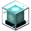


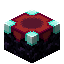
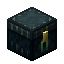

</p>

---

<p align="center">
  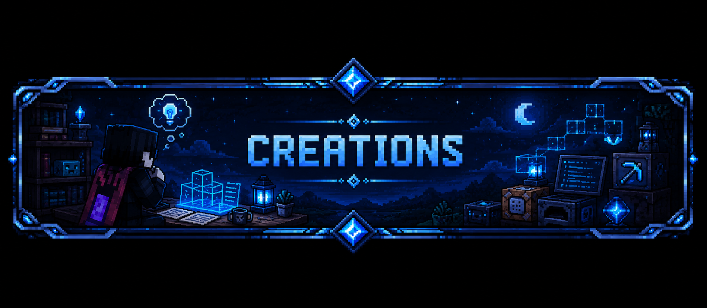
</p>

<p align="center">
  
</p>

###  Nothion Core

Advanced prison infrastructure combining regenerative mines, offline player markets, economy systems and custom gameplay integrations.

---

###  Boss Progression System

Multi-difficulty boss architecture with dynamic scaling, reward progression, arena control and MythicMobs integration.

---

###  ProgressionCore

Custom survival progression framework inspired by RPG and sandbox mechanics.

---

###  Experimental Mechanics

Dynamic mines, puzzle systems, lore progression, magical mechanics, NPC interactions and advanced GUI workflows.

---

<p align="center">
  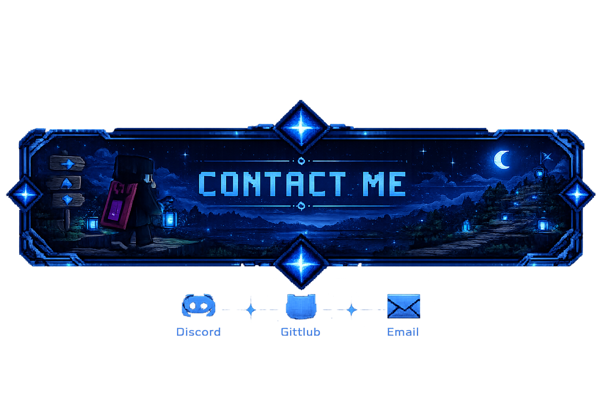
</p>

<p align="center">
  
</p>

<p align="center">
  Discord: <code>its_asd</code><br>
  GitHub: <code>ItsAsddd</code><br>
  Network: <code>NothionMC</code>
</p>

---

<p align="center">


<br><br>


</p>
