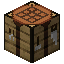
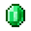
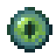
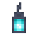

<p align="center">
  
</p>

<h1 align="center">ItsAsd</h1>

<p align="center">
  Minecraft Systems Developer • Gameplay Engineer • Creative Builder
</p>

<p align="center">
  
</p>
<br>

<p align="center">
  
  
  
  
  
  
</p>

---

<p align="center">
  
</p>

<p align="center">
  
</p>

I started experimenting with Minecraft servers back in 2016 using small Aternos worlds while barely running the game at 15 FPS.

What started as simple server configuration slowly became a passion for gameplay systems, multiplayer infrastructure and immersive experiences.

Today, I focus on creating systems that transform Minecraft into something deeper, more dynamic and more memorable.

-  Passionate about mining systems
-  Backend & gameplay focused
-  Self-taught developer
-  Always experimenting with new mechanics

---

<p align="center">
  
</p>

<p align="center">
  
</p>

```txt
2016 -> First Aternos server
2018 -> Learning plugins & server setup
2020 -> Public Minecraft networks
2022 -> Custom gameplay mechanics
2024 -> Large-scale core systems
2026 -> Gameplay & infrastructure focused development
```

Most of my experience comes from:

-  Documentation
-  Trial & error
-  Communities
-  Real project experimentation

---

<p align="center">
  
</p>

<p align="center">
  
</p>

<table>
<tr>

<td valign="top">

### Systems

- Progression Systems
- Economy Mechanics
- Mining Systems
- Prison Systems
- RPG Features
- Custom Bosses

</td>

<td valign="top">

### Backend

- Velocity Networks
- Server Infrastructure
- Optimization
- Persistent Data
- Large Gameplay Cores
- Multiplayer Architecture

</td>

<td valign="top">

### Creative

- Gameplay Design
- Custom Mechanics
- Lore Systems
- Puzzle Design
- UI/UX for Minecraft
- Community-focused Development

</td>

</tr>
</table>

<br>

<p align="center">


</p>

---

<p align="center">
  
</p>

<p align="center">
  
</p>

---

##  ASDCore

<p align="center">
  <a href="https://github.com/ItsAsddd/ASDCore-Showcase">
    
  </a>
</p>

### <span style="color:#7DD3FC">Advanced Prison Infrastructure Framework</span>

Large-scale Minecraft core combining:
- regenerative mines
- offline player markets
- ranked PvP systems
- magical progression
- custom items
- region infrastructures
- donation systems
- fishing mechanics
- holograms
- placeholders
- Discord synchronization

Designed as a complete MMORPG-style infrastructure for prison networks.

<p align="center">
  <a href="https://github.com/ItsAsddd/ASDCore-Showcase">
    
  </a>
</p>

---

##  MinasASD

<p align="center">
  <a href="https://github.com/ItsAsddd/MinasASD">
    
  </a>
</p>

### <span style="color:#7DD3FC">Dynamic Mine Infrastructure</span>

Advanced mine ecosystem featuring:
- non-cubic dynamic mines
- custom drops
- environmental effects
- hologram systems
- beacon infrastructures
- Anti-Xray
- Discord synchronization
- progression-based mining

Built to transform prison mines into immersive gameplay experiences.

<p align="center">
  <a href="https://github.com/ItsAsddd/MinasASD">
    
  </a>
</p>

---

##  CrafteosASD

<p align="center">
  <a href="https://github.com/ItsAsddd/CrafteosASD">
    
  </a>
</p>

### <span style="color:#7DD3FC">Modular Crafting Infrastructure</span>

Custom crafting framework supporting:
- crafting tables
- furnaces
- anvils
- recipe blocking
- progression crafting
- custom item integrations
- GUI recipe editing
- advanced item comparison systems

Focused on scalable crafting progression and RPG survival mechanics.

<p align="center">
  <a href="https://github.com/ItsAsddd/CrafteosASD">
    
  </a>
</p>

---

##  BBattlesASD

<p align="center">
  <a href="https://github.com/ItsAsddd/BBattlesASD">
    
  </a>
</p>

### <span style="color:#7DD3FC">BossBattle Arena Framework</span>

Round-based combat infrastructure with:
- scalable boss arenas
- MythicMobs integration
- unlockable progression
- advanced mob editors
- cinematic battle flow
- reward systems
- spectators
- statistics & placeholders

Created for immersive RPG-style multiplayer combat experiences.

<p align="center">
  <a href="https://github.com/ItsAsddd/BBattlesASD">
    
  </a>
</p>

---

##  MobileShopASD

<p align="center">
  <a href="https://github.com/ItsAsddd/MobileShopASD">
    
  </a>
</p>

### <span style="color:#7DD3FC">Marketplace & Commerce Infrastructure</span>

Advanced player marketplace ecosystem featuring:
- upgradeable player shops
- physical rentable markets
- Discord commerce
- ratings & rankings
- offline deliveries
- boosters
- NPC integration
- transaction history

Designed to create immersive multiplayer economies and player-driven commerce.

<p align="center">
  <a href="https://github.com/ItsAsddd/MobileShopASD">
    
  </a>
</p>

---

<p align="center">
  
</p>

-  Advanced Minecraft progression systems
-  Multiplayer gameplay architectures
-  Experimental mechanics & immersive experiences
-  Large-scale custom infrastructures
-  RPG-oriented server ecosystems

---
<p align="center">
  
</p>

<p align="center">
  
</p>

<br>

<p align="center">
  
</p>

<p align="center">

Discord: <code>its_asd</code>

GitHub: <code>ItsAsddd</code>

Network: <code>NothionMC</code>

</p>

<br>

<p align="center">
  
  
  
</p>
